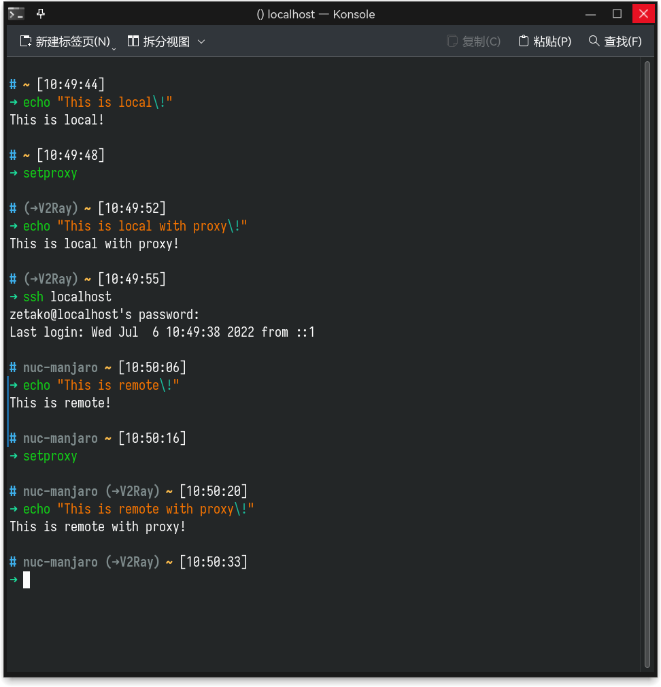

# zstro-zsh-theme
A re-written version of astro-ssh-zsh-theme.

## Astro-ssh-zsh-theme

> Astro theme is based on [`ys`](http://blog.ysmood.org/my-ys-terminal-theme/) theme and `robbyrushell` (default theme) theme.
> 
> Astro-SSH theme is based on Astro theme with a patch to show hostname when using ssh connect 

## Screenshot



## Progress

### What's new?

Basically, there is nothing new, expect a proxy display using MY OWN global variable called $ZETAKO_PROXY. If you don't have a script interact with it, it will be no different with the old astro-ssh theme.

### TODO

- [ ] Give return value when return error.
- [ ] Rewrite scripts, using zsh script's function.
- [ ] Add a one-line installation command or a .sh to help install.

## Installation

### Clone the repository:
```
$ git clone https://github.com/zetako/zstro-zsh-theme.git
```

### Apply theme 
1. Copy `zstro.zsh-theme` file into the `~/.oh-my-zsh/themes/` directory.
2. Change the theme variable name to `ZSH_THEME="zstro"` in `~/.zshrc`
3. Reload ZSH with `source ~/.zshrc`